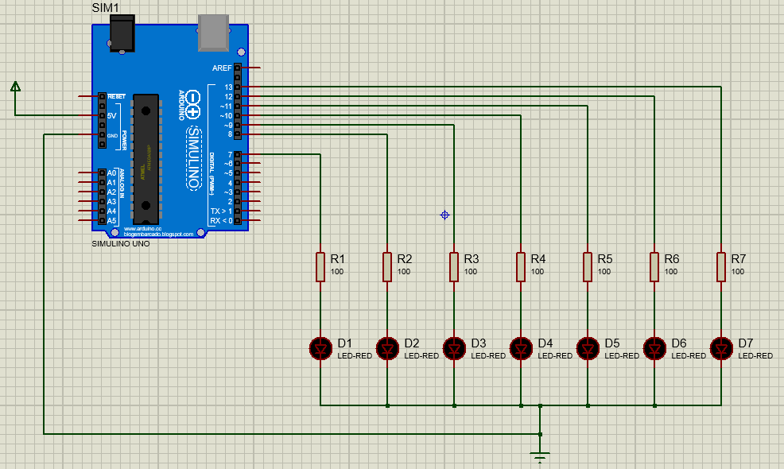

## Components
- SIMULINO UNO
- LED-RED x 7
- 100 Ohm x 7

## Circuit Diagram

</br></br>

## Codebase

```
int timer = 50;

void setup() {
  pinMode(7, OUTPUT);
  pinMode(8, OUTPUT);
  pinMode(9, OUTPUT);
  pinMode(10, OUTPUT);
  pinMode(11, OUTPUT);
  pinMode(12, OUTPUT);
  pinMode(13, OUTPUT);
}

void loop() {
  //Forward wave
  digitalWrite(7, HIGH);
  delay(timer);
  digitalWrite(7, LOW);
  digitalWrite(8, HIGH);
  delay(timer);
  digitalWrite(8, LOW);
  digitalWrite(9, HIGH);
  delay(timer);
  digitalWrite(9, LOW);
  digitalWrite(10, HIGH);
  delay(timer);
  digitalWrite(10, LOW);
  digitalWrite(11, HIGH);
  delay(timer);
  digitalWrite(11, LOW);
  digitalWrite(12, HIGH);
  delay(timer);
  digitalWrite(12, LOW);
  digitalWrite(13, HIGH);
  delay(timer);
  digitalWrite(13, LOW);
  
  //Reverse wave
  digitalWrite(12, HIGH);
  delay(timer);
  digitalWrite(12, LOW);
  digitalWrite(11, HIGH);
  delay(timer);
  digitalWrite(11, LOW);
  digitalWrite(10, HIGH);
  delay(timer);
  digitalWrite(10, LOW);
  digitalWrite(9, HIGH);
  delay(timer);
  digitalWrite(9, LOW);
  digitalWrite(8, HIGH);
  delay(timer);
  digitalWrite(8, LOW);
  digitalWrite(7, HIGH);
  delay(timer);
  digitalWrite(7, LOW);
}
```

## Steps to upload code into microcontroller
1. Open this codebase from Arduino IDE.</br>
2. Go to the <b>Sketch -> Export compiled binary</b>
3. And then get the <b>.hex</b> file and upload into the microcontroller

