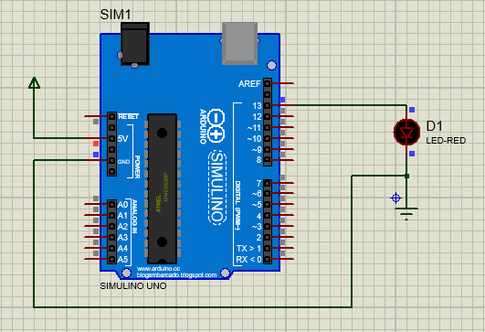

## Components
- SIMULINO UNO
- LED-RED

## Circuit Diagram

</br></br>

## Codebase

```
int LED = 13;

void setup() {
  pinMode(LED, OUTPUT);
}

void loop() {
  digitalWrite(LED, HIGH);  
  delay(1000);           
  digitalWrite(LED, LOW);  
  delay(1000);                     
}
```

## Steps to upload code into microcontroller
1. Open this codebase from Arduino IDE.</br>
2. Go to the <b>Sketch -> Export compiled binary</b>
3. And then get the <b>.hex</b> file and upload into the microcontroller

