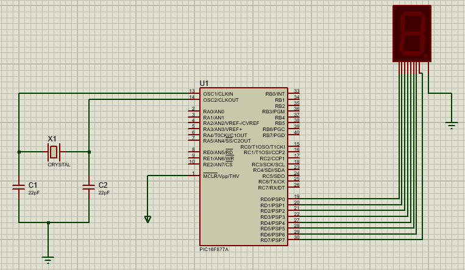

## Components
- 7SEG-MPX1-CC
- CAPASITOR
- CRYSTAL
- PIC16F877A

## Circuit Diagram

</br></br>

## Codebase

```
/* Main.c file generated by New Project wizard
 *
 * Created:   Thu Dec 29 2022
 * Processor: PIC16F877A
 * Compiler:  MPLAB XC8
 */

#include <htc.h>
#include <pic.h>

unsigned char binary_pattern[]={0x3F,0x06,0x5B,0x4F,0x66,0x6D,0x7D,0x07,0x7F,0x6F};

void main(void){
    TRISD = 0x00;
    
    while(1)
    {
        for (int i=0;i<10;i++){
            PORTD = binary_pattern[i];
	    __delay_ms(1000);
	} 
    }
    
    return;
}
```

