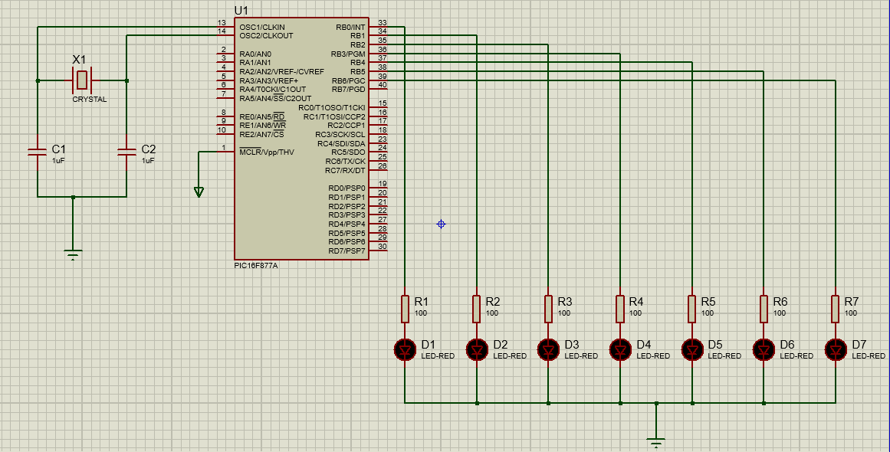

## Components
- LED-RED
- CAPASITOR
- CRYSTAL
- PIC16F877A


## Circuit Diagram

</br></br>

## Codebase

```
/* Main.c file generated by New Project wizard
 *
 * Created:   Thu Dec 29 2022
 * Processor: PIC16F877A
 * Compiler:  HI-TECH C for PIC10/12/16
 */

#include <htc.h>

void main(void){

   TRISB = 0;

   while (1){
   
      //First wave code=============================
      //D1
      RB0 = 1;
      __delay_ms(100);
      RB0 = 0;
      __delay_ms(100);
      
      //D2
      RB1 = 1;
      __delay_ms(100);
      RB1 = 0;
      __delay_ms(100);
      
      //D3
      RB2 = 1;
      __delay_ms(100);
      RB2 = 0;
      __delay_ms(100);
      
      //D4
      RB3 = 1;
      __delay_ms(100);
      RB3 = 0;
      __delay_ms(100);
      
      //D5
      RB4 = 1;
      __delay_ms(100);
      RB4 = 0;
      __delay_ms(100);
      
      //D6
      RB5 = 1;
      __delay_ms(100);
      RB5 = 0;
      __delay_ms(100);
      
      //D7
      RB6 = 1;
      __delay_ms(100);
      RB6 = 0;
      __delay_ms(100);
      
      
      
      //Reverse wave code=============================      
      //D6
      RB5 = 1;
      __delay_ms(100);
      RB5 = 0;
      __delay_ms(100);
      
      //D5
      RB4 = 1;
      __delay_ms(100);
      RB4 = 0;
      __delay_ms(100);
      
      //D4
      RB3 = 1;
      __delay_ms(100);
      RB3 = 0;
      __delay_ms(100);
      
      //D3
      RB2 = 1;
      __delay_ms(100);
      RB2 = 0;
      __delay_ms(100);
            
      //D2
      RB1 = 1;
      __delay_ms(100);
      RB1 = 0;
      __delay_ms(100);
      
   }
   
 }
```

