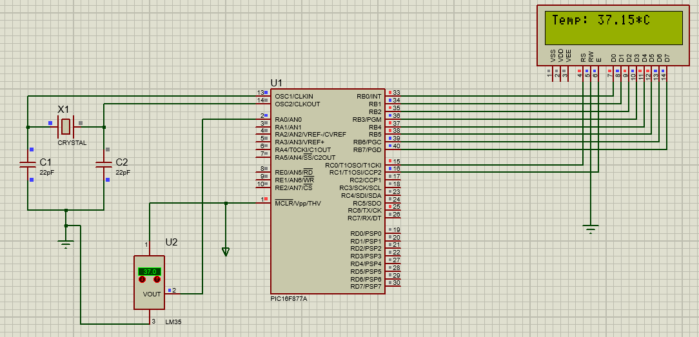

## Components
- LM35
- LM016L
- CAPASITOR
- CRYSTAL
- PIC16F877A

## Circuit Diagram

</br></br>

## Codebase

```
#include<pic.h>

#include<stdio.h>

void delay(unsigned int x) {
  while (x--);
}

void cmd(char c) {
  RC0 = 0;
  RC1 = 1;
  delay(200);
  PORTB = c;
  delay(2000);
  RC1 = 0;
  delay(200);
}

char * c = "Temp:      *C";
void disp() {
  RC0 = 1;
  while ( * c != '\0') {
    RC1 = 1;
    delay(2000);
    PORTB = * c;
    c++;
    delay(2000);
    RC1 = 0;
  }
}
void data(char c) {
  RC0 = 1;
  RC1 = 1;
  delay(200);
  PORTB = c;
  delay(2000);
  RC1 = 0;
  delay(200);
}

void lcd_init() {
  TRISB = 0x00; // Data Port
  TRISC0 = 0; //RS
  TRISC1 = 0; //E
  PORTB = 0x00;
  RC0 = 0;
  RC1 = 0;
  cmd(0x0c);
  cmd(0x06);
  cmd(0x80);
}

void adc_init() {
  TRISA = 0xff;
  ADCON0 = 0x81;
  ADCON1 = 0x40; // ADFM = 1 (oxc0)  | ADFM = 0  (0x40)
  ADRESH = 0x00;
  ADRESL = 0X00;
}

int adc_read() {
  int a = ADRESL, b = ADRESH;
  //	b = a + (b<<8);				// (ADFM = 1)
  b = (b << 2) + (a >> 6); // shifting opt is done for placing the adc value in correct position ( ADFM = 0)
  ADRESH = 0x00;
  ADRESL = 0x00;
  return b;
}

void usart_init() {
  TRISC6 = 0; //TX port
  TRISC7 = 1; //RX port
  TXSTA = 0x24; // TX Reg
  RCSTA = 0x90; //RX Reg
  SPBRG = 129; // BPS set
  delay(100);
}

void main() {
  float temp = 0;
  int adc_val = 0;
  char buf[10];
  lcd_init();
  adc_init();
  usart_init();
  TXIF = 0;
  disp();
  while (1) {
    GO = 1;
    while (GO == 1);
    adc_val = adc_read();
    temp = (adc_val * (500.0 / 1023.0));
    sprintf(buf, "%.2f", temp);
    cmd(0x86);
    for (int i = 0; i < 5; i++) {
      data(buf[i]);
      delay(2000);
    }
    while (!TXIF);
    TXIF = 0;
    TXREG = 12;
  }
}
```

