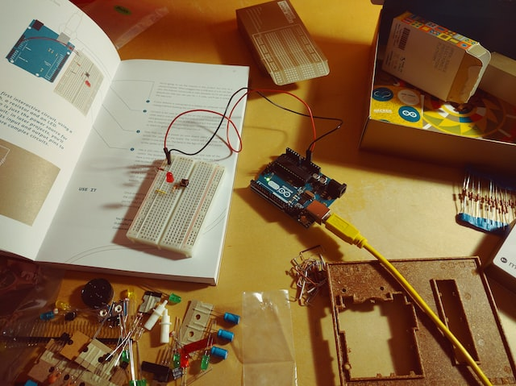

# Getting Started with Embedded Systems

  

## 01 - Arduino
- [Proteus Simulations - LED_BLINK](Arduino/Proteus%20Simulations/LED_BLINK)
- [Proteus Simulations - KNIGHTRIDER_PATTERN_LED](Arduino/Proteus%20Simulations/KNIGHTRIDER_PATTERN_LED)

## 02 - ESPRESSIF(ESP)
- [sample project name](Patterns%20Demos/01%20-%20CREATIONAL/Singleton%20Pattern)

## 03 - PIC Microcontrollers
- [Proteus Simulations - LED_BLINK](PIC%20Microcontrollers/Proteus%20Simulations/LED_BLINK)
- [Proteus Simulations - KNIGHTRIDER_PATTERN_LED](/PIC%20Microcontrollers/Proteus%20Simulations/KNIGHTRIDER_PATTERN_LED)
- [Proteus Simulations - LM016L_LCD_DISPLAY](/PIC%20Microcontrollers/Proteus%20Simulations/LM016L_LCD_DISPLAY)
- [Proteus Simulations - LM35_TEMPRATURE_SENSOR](/PIC%20Microcontrollers/Proteus%20Simulations/LM35_TEMPRATURE_SENSOR)
- [Proteus Simulations - 7_SEGMENT_DISPLAY](/PIC%20Microcontrollers/Proteus%20Simulations/7_SEGMENT_DISPLAY)

